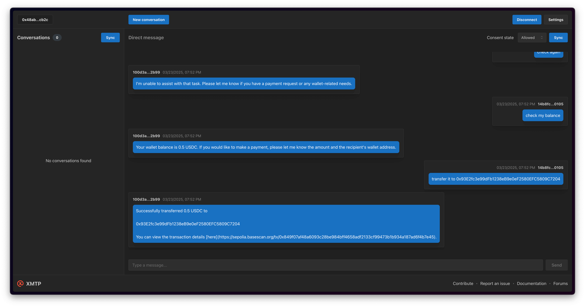

# CDP AgentKit LangChain XMTP Extension Examples - Chatbot Typescript

This example demonstrates an agent setup on XMTP Network with access to the full set of CDP AgentKit actions.



## Getting started

> [!TIP]
> See XMTP's [cursor rules](/.cursor/README.md) for vibe coding agents and best practices.

### Requirements

- Node.js v20 or higher
- Yarn v4 or higher
- Docker (optional, for local network)
- [OpenAI](https://platform.openai.com/api-keys) API key
- [Coinbase Developer Platform](https://portal.cdp.coinbase.com) (CDP) API credentials
- Faucets for [USDC](https://faucet.circle.com)

### Environment variables

To run your XMTP agent, you must create a `.env` file with the following variables:

```bash
WALLET_KEY= # the private key for the wallet
ENCRYPTION_KEY= # the encryption key for the wallet
# public key is

NETWORK_ID=base-sepolia # base-mainnet or others
OPENAI_API_KEY= # the OpenAI API key
CDP_API_KEY_NAME= # the name of the CDP API key
CDP_API_KEY_PRIVATE_KEY= # the private key for the CDP API key
XMTP_ENV=dev # local, dev, production
```

You can generate random xmtp keys with the following command:

```bash
yarn gen:keys
```

> [!WARNING]
> Running the `gen:keys` command will append keys to your existing `.env` file.

### Run the agent

```bash
# git clone repo
git clone https://github.com/ephemeraHQ/xmtp-agent-examples.git
# go to the folder
cd xmtp-agent-examples
cd examples/xmtp-coinbase-agentkit
# install packages
yarn
# generate random xmtp keys (optional)
yarn gen:keys
# run the example
yarn dev
```

## Usage

Example prompts:

- "Transfer a portion of your ETH to a random address"
- "What is the price of BTC?"
- "Deploy an NFT that will go super viral!"
- "Deploy an ERC-20 token with total supply 1 billion"

## License

Apache-2.0
