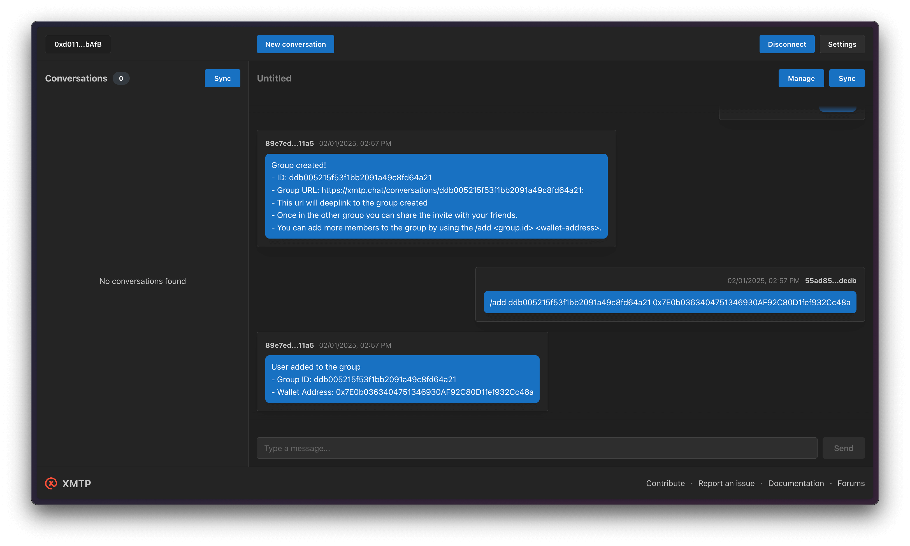

# Building a gated group with NFT verification

To create a gated group chat using XMTP, you will need an admin bot within the group to manage member additions and removals. The admin bot will create the group, assign you as the admin, and then verify NFT ownership before adding new members.



## Getting started

> [!TIP]
> See XMTP's [cursor rules](/.cursor/README.md) for vibe coding agents and best practices.

### Requirements

- Node.js v20 or higher
- Yarn v4 or higher
- Docker (optional, for local network)

### Environment variables

To run your XMTP agent, you must create a `.env` file with the following variables:

```bash
WALLET_KEY= # the private key of the wallet
ENCRYPTION_KEY= # encryption key for the local database
XMTP_ENV=dev # local, dev, production
ALCHEMY_API_KEY= # alchemy api to check NFT ownership
```

You can generate random xmtp keys with the following command:

```bash
yarn gen:keys
```

> [!WARNING]
> Running the `gen:keys` command will append keys to your existing `.env` file.

### Run the agent

```bash
# git clone repo
git clone https://github.com/ephemeraHQ/xmtp-agent-examples.git
# go to the folder
cd xmtp-agent-examples
cd examples/xmtp-nft-gated-group
# install packages
yarn
# generate random xmtp keys (optional)
yarn gen:keys
# run the example
yarn dev
```

## Usage

1. Start the bot with your environment variables configured
2. Message the bot at its address to create a new group using `/create`
3. Once you have the group ID, you can add members using `/add <group_id> <wallet_address>`
4. The bot will verify NFT ownership and add the wallet if they own the required NFT

### Commands

- `/create` - Creates a new gated group

```bash
if (message.content === "/create") {
  console.log("Creating group");
  const group = await client.conversations.newGroup([]);
  await group.addMembers([message.senderInboxId]);
  await group.addSuperAdmin(message.senderInboxId);

  await conversation.send(
    `Group created!\n- ID: ${group.id}\n- Group URL: https://xmtp.chat/conversations/${group.id}`,
  );
  return;
}
```

- `/add <group_id> <wallet_address>` - Adds a wallet to an existing group (if they own the required NFT)

```bash
// Handle /add command
if (message.content.startsWith("/add")) {
  const groupId = message.content.split(" ")[1];
  const walletAddress = message.content.split(" ")[2];

  const result = await checkNft(walletAddress, "XMTPeople");
  if (!result) {
    console.log("User can't be added to the group");
    return;
  } else {
    await group.addMembers([walletAddress]);
    await conversation.send(
      `User added to the group\n- Group ID: ${groupId}\n- Wallet Address: ${walletAddress}`,
    );
  }
}
```

## Verify NFT ownership

The bot checks if a wallet owns the required NFT using Alchemy's API:

```bash
async function checkNft(
  walletAddress: string,
  collectionSlug: string,
): Promise<boolean> {
  const alchemy = new Alchemy(settings);
  try {
    const nfts = await alchemy.nft.getNftsForOwner(walletAddress);

    const ownsNft = nfts.ownedNfts.some(
      (nft) =>
        nft.contract.name?.toLowerCase() === collectionSlug.toLowerCase(),
    );
    console.log("is the nft owned: ", ownsNft);
    return ownsNft;
  } catch (error) {
    console.error("Error fetching NFTs from Alchemy:", error);
  }
  return false;
}
```
